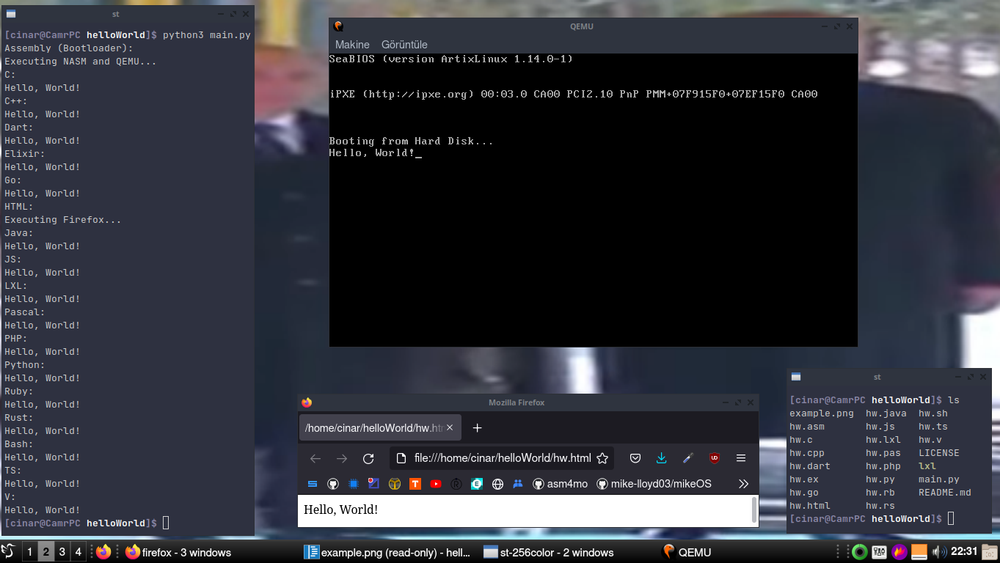

# helloWorld
Hello World programs in all languages!
</img>

## How to run
You need these packages/applications installed:
1. `nasm`
2. `qemu`
3. `gcc`
4. `dart`
5. `elixir`
6. `go`
7. `firefox`
8. `node`
9. `fpc` (Free Pascal Compiler)
10. `php`
11. `python3`
12. `ruby`
13. `rust`
14. `npm` - `ts-node` package
15. `sh`
16. `jdk8-openjdk` (Its name may be different in your package manager.)

This means;
1. Assembly
2. C
3. C++
4. Dart
5. Elixir
6. Go
7. HTML
8. JavaScript
9. Pascal
10. PHP
11. Python
12. Ruby
13. Rust
14. TypeScript
15. Bash
16. Java